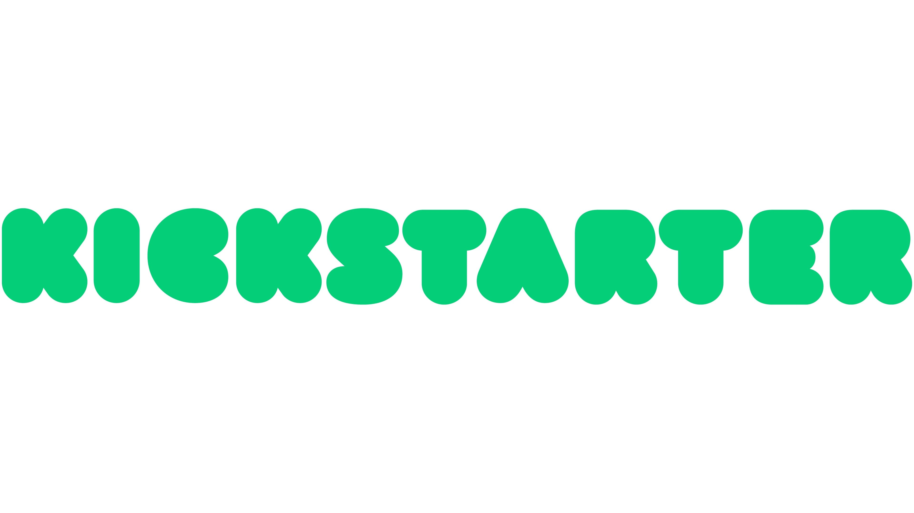

# kickstarter-analysis
The dataset is used for various analyses and visualizations, aiming to explore patterns and trends in Kickstarter campaigns. The goal is to understand what makes a Kickstarter project successful or failed.
## Data Handling Summary
1-Drop unnecessary columns which including (url,comments,name) \n
2-Removed duplicate rows
3-New column were created for the purpose of deeper analysis, such as (in us) These column helped us understand project dynamics and identify key patterns that influence success. However, these columns were not relevant for machine learning model training, where we focus on the original, more fundamental features of the dataset.
4-A small number of rows with missing values in (location,reward levels) were dropped would not significantly impact the dataset or analysis.
## Data Dictionary
| Column Name         | Description                                                       | Data Type    |
|---------------------|-------------------------------------------------------------------|--------------|
| `project_id`        | A unique identifier for each project.                             | Integer      |
| `category`          | The category under which the project was launched (e.g., "Technology", "Art"). | Object       |
| `subcategory`       | A more specific classification within the main `category`                             | Object      |
| `location  `        | The geographic location of the project creator or where the project is based.          | Object      |
| `status`            | The final status of the project (e.g., "successful", "failed").   | Object  |
| `goal`              | The funding goal the project aims to raise in USD.                             | Float      |
| `pledged`           | The total amount of money pledged by backers in USD.              | Float        |
| `funded percentage` | The percentage of the funding goal that the project                             | Float     |
| `backers`           | The total number of backers for the project.                      | Integer      |
| `funded_date`       | The date and time when the project was launched.                  | Object     |
| `levels`            | Different tiers or levels of pledge amounts set by the project creator.                         | Integer     |
| `rewerd levels` | The corresponding rewards or perks that backers receive at each `level` | Object      |
| `updates` | Regular posts or emails to keep backers informed about progress, milestones, or challenges | Integer        |
| `duration`        | The duration of the project campaign in days                           | Float      |
## Quantitative Data Analysis
Through the analysis of Kickstarter project data, able to uncover some key insights into the factors influencing project success and failure. For instance, successful projects tend to have higher average pledge amounts and more backers compared to failed projects. The average pledge for successful campaigns is noticeably higher, indicating that backers are more committed to these projects.
The dataset has its limitations. Key attributes such as the creator's previous success rate, marketing efforts, and backer demographics are not captured in the data, which restricts the depth of the analysis.
